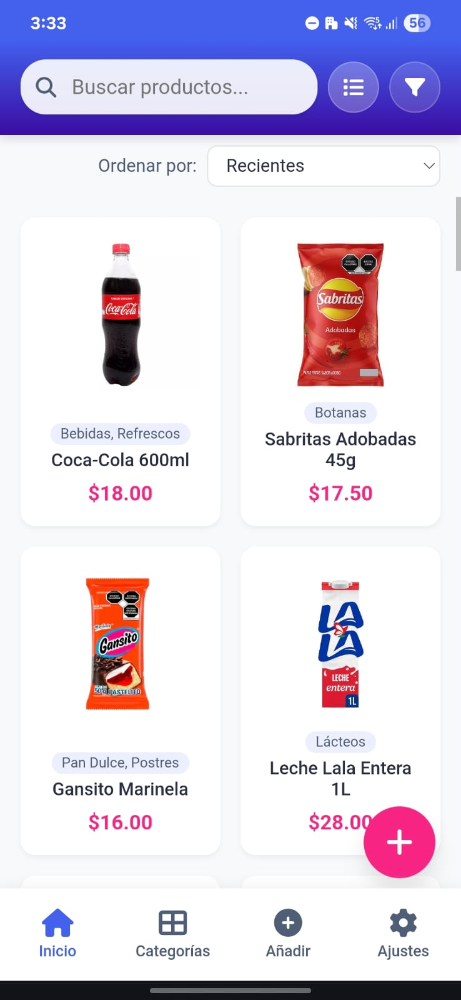
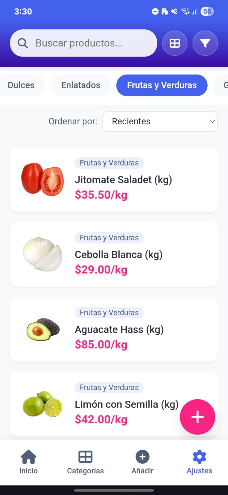
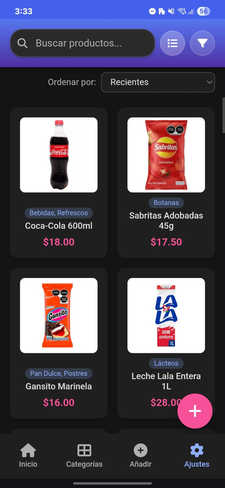
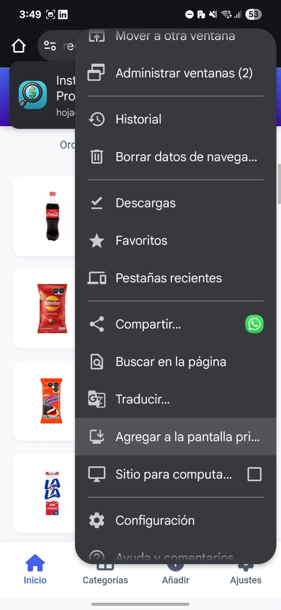
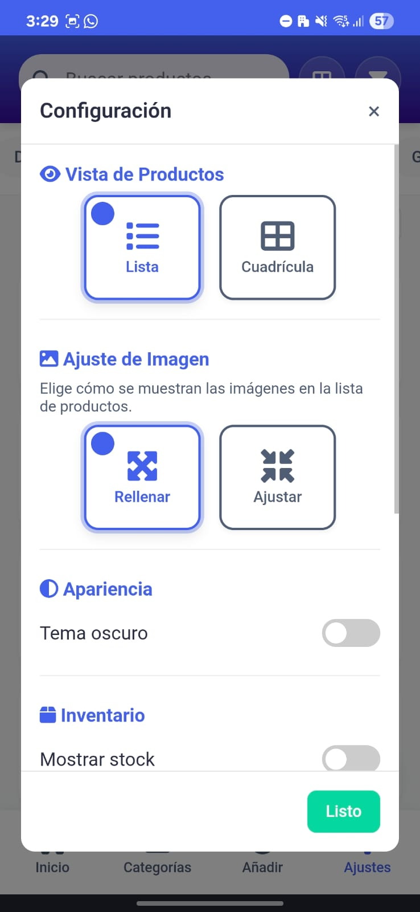
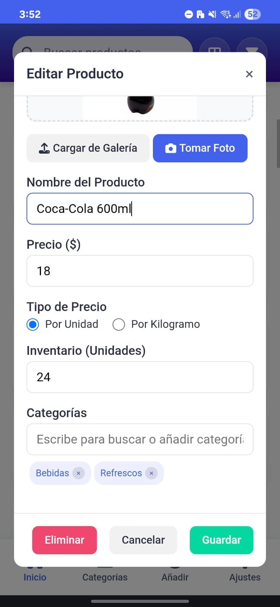
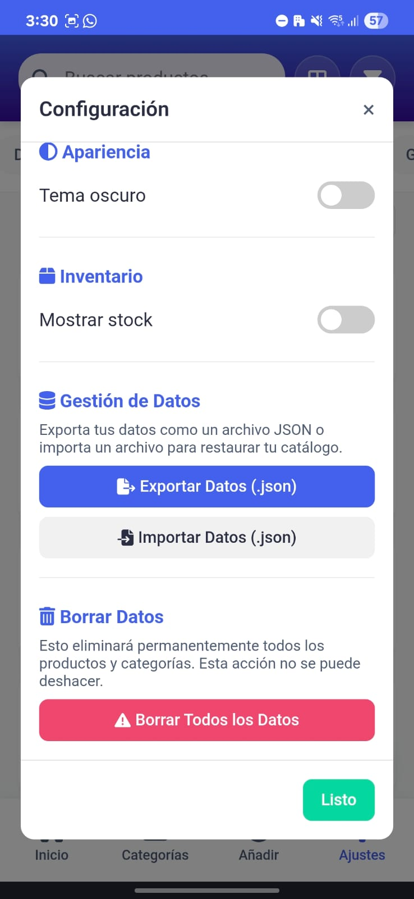
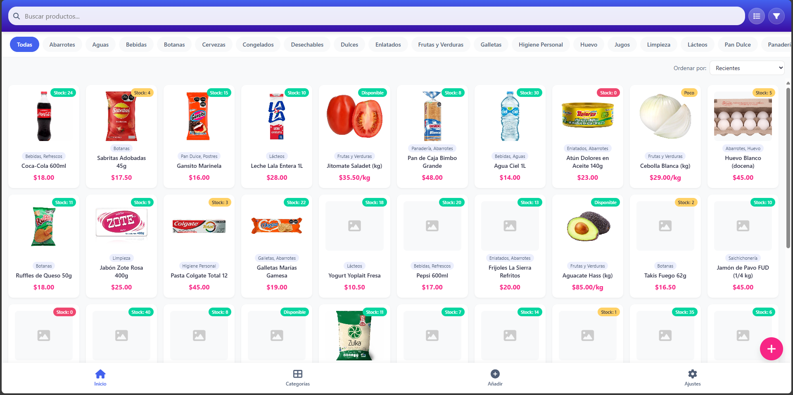

<div align="center">
  
  <h1>Catálogo de Productos</h1>
  <p>
    Una <b>Aplicación Web Progresiva (PWA)</b> moderna para gestionar catálogos de productos, con funcionalidades sin conexión e instalación en dispositivos
  </p>

  <!-- Badges Tecnológicos -->
  <p>
    
    
    
    
  </p>

  <p>
    <b>Estado del Proyecto:</b> En desarrollo 🚧
  </p>
</div>

---

## ✨ Demostración Visual

Un recorrido visual por las principales funcionalidades de la aplicación en formato móvil.

| Vista Principal y Modos | Búsqueda y Filtros |
| :---: | :---: |
| _Visualiza tus productos en cuadrícula o lista, con temas claro y oscuro._ | _Encuentra lo que necesitas al instante con filtros y búsqueda en tiempo real._ |
|  |  |
|  |  |

<br>

| Gestión de Productos | Panel de Configuración |
| :---: | :---: |
| _Un formulario completo para añadir o editar cada detalle de tus productos._ | _Personaliza la experiencia y gestiona tus datos fácilmente._ |
|  |  |
|  |  |

<div align="center">
  <h3>Vista en Escritorio</h3>
  <p><em>Posibilidad de usarse en pc o tablet.</em></p>
  
</div>


<br>

<div align="center">
  <a href="https://hojadeprecios.netlify.app/" target="_blank">
    
  </a>
</div>

---

## 🚀 Características Principales

- **📱 PWA Integrada:** Instala la aplicación directamente desde el navegador en tu dispositivo móvil o de escritorio para una experiencia nativa.
- **📦 Gestión de Productos Completa:** Añade, edita y elimina productos con imágenes, categorías personalizadas, tipo de precio y gestión de inventario (por unidad o disponibilidad).
- **🎨 Personalización Visual:** Cambia entre vista de lista o cuadrícula y elige entre un tema claro o uno oscuro para adaptarla a tus preferencias.
- **🔍 Búsqueda, Filtros y Ordenamiento:** Encuentra productos al instante con la barra de búsqueda, filtra por categorías y ordena los resultados por precio, nombre o stock.
- **💾 Importación y Exportación de Datos:** Respalda y restaura tu catálogo completo con archivos `.json` de forma segura.
- **📱 Interfaz Responsiva:** Diseñada principalmente para móviles, se adapta perfectamente a cualquier tamaño de pantalla.

---

## 🛠️ Tecnologías Utilizadas

* **HTML5:** Estructura semántica de la aplicación.
* **CSS3:** Estilos modernos, Flexbox, Grid y variables para temización.
* **JavaScript (ES6+):** Lógica de la aplicación y funcionalidades dinámicas.
* **PWA (Progressive Web App):** Service Worker para uso offline y Manifest para instalación.
* **Font Awesome:** Iconos utilizados en toda la interfaz.

---

## 📦 Cómo Empezar

Puedes probar la aplicación directamente en la web o ejecutarla localmente.

### En la Web

1.  **Abre la aplicación:**
    Navega a la dirección **[hojadeprecios.netlify.app](https://hojadeprecios.netlify.app/)**.

2.  **Instala la PWA:**
    Busca el icono de instalación en la barra de direcciones de tu navegador (en escritorio) o la opción "Añadir a pantalla de inicio" (en móvil) para usarla como una app nativa.

### Localmente

Para ejecutar este proyecto de manera local, necesitas un servidor web simple para evitar problemas de CORS con el `service-worker`.

1.  **Clona el repositorio:**
    ```bash
    git clone https://github.com/TuUsuario/TuRepositorio.git
    cd TuRepositorio
    ```

2.  **Inicia un servidor local:**
    Si tienes Python 3 instalado, puedes usar:
    ```bash
    python -m http.server
    ```
    O si tienes `live-server` de npm:
    ```bash
    live-server
    ```

3.  **Abre la aplicación** en `http://localhost:8000` (o el puerto que indique tu servidor).

---

Siéntete libre de contribuir o contactar al autor para más información.
